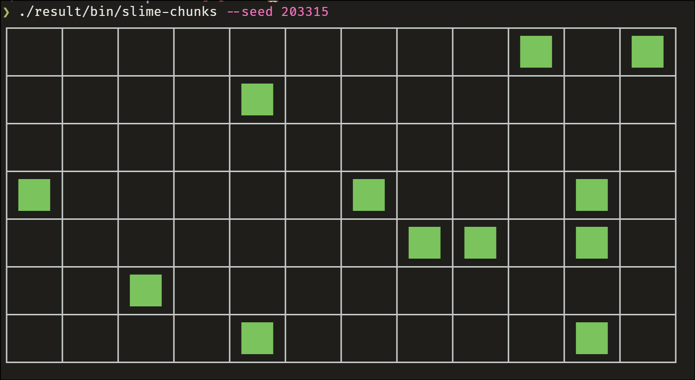

# slime-chunks

A tiny cli that finds [slime chunks](https://minecraft.wiki/w/Slime#Slime_chunks) in Minecraft and renders them as a grid around a chosen coordinate.



The grid is centered on the chunk containing the given `(x, z)` block coordinate, and its size is chosen automatically to fit your terminal.

## Usage

```console
$ slime-chunks --seed 12345 --x 0 --z 0
```

| Flag             | Short | Type  | Description                |
| ---------------- | ----- | ----- | -------------------------- |
| `--seed`         | `-s`  | int64 | World seed (**required**)  |
| `--x`            |       | int32 | X block coordinate         |
| `--z`            |       | int32 | Z block coordinate         |
| `--help`         | `-h`  |       | Show help                  |

> [!NOTE]
> The output is sized to the terminal, thus it is recommended to run it in an interactive terminal rather than piping the output.

## Installation

### With Nix (flakes)

Run it directly without installing:

```sh
$ nix run github:abiriadev/slime-chunks -- --seed 12345
```

Add it to your own flake:

```nix
{
  inputs.slime-chunks.url = "github:abiriadev/slime-chunks";
}
```

### With Go

```sh
$ go install github.com/abiriadev/slime-chunks@latest
```

## Build

```sh
$ nix develop
$ go build ./...
$ go run . --seed 12345
```

Build the package with Nix:

```console
$ nix build
$ ./result/bin/slime-chunks --seed 12345
```

## License

[](./LICENSE)
